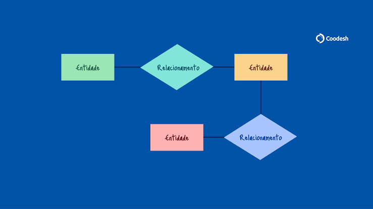
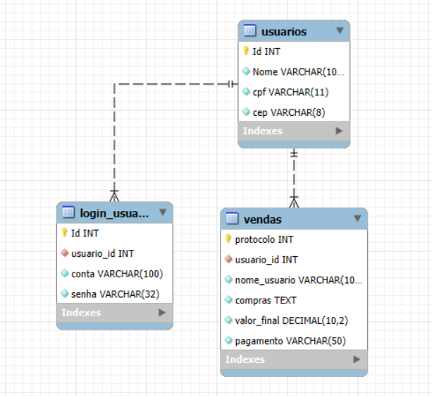

# INFILME
**Arthur Teixeira e Bernardo Silva**

- O projeto, INFILME, consiste em um sistema web para compra de filmes, onde o cliente realiza um cadastro e login no sistema, visualiza os filmes disponíveis no catálogo, adiciona os filmes no carrinho e finaliza a compra por meio de vários métodos de pagamento, como cartão, boleto e pix. 
- Em resumo, o sistema possui o cadastro e login do usuário, os filmes disponíveis, o carrinho, onde o cliente pode adicionar ou remover filmes, e o pagamento que possibilita a compra.

**Modelo Entidade Relacionamento:**

**Modelo Lógico:**

**SQL para criação do banco de dados:**

CREATE DATABASE infilme;

USE infilme;

CREATE TABLE usuarios (
    Id INT AUTO_INCREMENT PRIMARY KEY,
    Nome VARCHAR(100) NOT NULL,
    cpf VARCHAR(11) NOT NULL UNIQUE,
    cep VARCHAR(8) NOT NULL
);

CREATE TABLE login_usuario (
    Id INT AUTO_INCREMENT PRIMARY KEY,
    usuario_id INT NOT NULL,
    conta VARCHAR(100) NOT NULL UNIQUE,
    senha VARCHAR(32) NOT NULL,

    CONSTRAINT fk_login_usuario
    FOREIGN KEY (usuario_id)
    REFERENCES usuarios(Id)
);

CREATE TABLE vendas (
    protocolo INT AUTO_INCREMENT PRIMARY KEY,
    usuario_id INT NOT NULL,
    nome_usuario VARCHAR(100) NOT NULL,
    compras TEXT NOT NULL,
    valor_final DECIMAL(10,2) NOT NULL,
    pagamento VARCHAR(50) NOT NULL,

    CONSTRAINT fk_vendas_usuario
    FOREIGN KEY (usuario_id)
    REFERENCES usuarios(Id)
);
