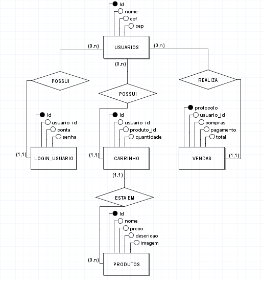

# INFILME
**Arthur Teixeira Soares e Bernardo Silva Gomes**

# Descrição do sistema
O INFILME é um sistema web de aluguel de filmes. O objetivo é oferecer ao cliente uma vitrine online onde ele pode conhecer os filmes disponíveis, escolher os que deseja, montar um carrinho e finalizar o aluguel, recebendo um número de protocolo como comprovante.
O que o sistema permite realizar
- Consultar o catálogo de filmes, com imagem, descrição, gênero e preço.
- Cadastrar-se e acessar o sistema com usuário e senha.
- Adicionar filmes ao carrinho, controlar a quantidade e remover itens.
- Finalizar a compra escolhendo a forma de pagamento e obter o protocolo.

# Principais funcionalidades
- Vitrine de filmes: os filmes são carregados do banco de dados, sem precisar alterar o código para incluir ou mudar um produto.
- Cadastro e login: os dados pessoais (nome, CPF e CEP) ficam separados dos dados de acesso (usuário e senha criptografada).
- Carrinho de compras: cada usuário tem seu carrinho salvo no banco, com a quantidade de cada filme. O preço não é repetido no carrinho, pois é lido da tabela de produtos.
- Finalização da compra: registra a venda, seus itens, a forma de pagamento (cartão de crédito, PIX ou boleto), o total e o protocolo.

# Informações que precisam ser armazenadas
- usuarios:
Código, nome completo, CPF (único) e CEP do cliente.
- login_usuario:
Código do usuário, nome de usuário (único) e senha em md5. Não guarda CPF.
- generos:
Código e nome do gênero (Ação, Animação, Comédia, Crime, Ficção Científica).
- produtos:
Código, nome, preço, descrição, imagem e gênero do filme.
- carrinho:
Código, usuário, filme e quantidade. Não guarda preço.
- vendas:
Protocolo, usuário, data e hora, forma de pagamento e total da compra.
- itens_venda:
Protocolo da venda, filme, quantidade e preço cobrado na data da compra.


**Modelo Entidade Relacionamento:**




**Modelo Lógico:**


**SQL para criação do banco de dados:**
```
CREATE DATABASE IF NOT EXISTS infilme;
USE infilme;

CREATE TABLE usuarios (
    Id INT AUTO_INCREMENT PRIMARY KEY,
    nome VARCHAR(100) NOT NULL,
    cpf VARCHAR(11) NOT NULL UNIQUE,
    cep VARCHAR(8) NOT NULL
);

CREATE TABLE login_usuario (
    Id INT AUTO_INCREMENT PRIMARY KEY,
    usuario_id INT NOT NULL,
    conta VARCHAR(100) NOT NULL,
    senha VARCHAR(255) NOT NULL,
    CONSTRAINT fk_login_usuario FOREIGN KEY (usuario_id) 
        REFERENCES usuarios(Id) ON DELETE CASCADE
);

CREATE TABLE produtos (
    Id INT AUTO_INCREMENT PRIMARY KEY,
    nome VARCHAR(100) NOT NULL,
    preco DECIMAL(10,2) NOT NULL,
    descricao TEXT,
    imagem VARCHAR(100)
);

CREATE TABLE carrinho (
    Id INT AUTO_INCREMENT PRIMARY KEY,
    usuario_id INT NOT NULL,
    produto_id INT NOT NULL,
    quantidade INT NOT NULL DEFAULT 1,
    CONSTRAINT fk_carrinho_usuario FOREIGN KEY (usuario_id) 
        REFERENCES usuarios(Id) ON DELETE CASCADE,
    CONSTRAINT fk_carrinho_produto FOREIGN KEY (produto_id) 
        REFERENCES produtos(Id) ON DELETE CASCADE
);

CREATE TABLE vendas (
    protocolo INT AUTO_INCREMENT PRIMARY KEY,
    usuario_id INT NOT NULL,
    compras TEXT NOT NULL,
    pagamento VARCHAR(50) NOT NULL,
    total DECIMAL(10,2) NOT NULL,
    CONSTRAINT fk_vendas_usuario FOREIGN KEY (usuario_id) 
        REFERENCES usuarios(Id) ON DELETE CASCADE
);

INSERT INTO usuarios (nome, cpf, cep) VALUES
('Arthur Silva', '12345678901', '45820000'),
('Bruno Santos', '23456789012', '45821000'),
('Carlos Oliveira', '34567890123', '45822000'),
('Daniel Souza', '45678901234', '45823000'),
('Eduardo Costa', '56789012345', '45824000');

INSERT INTO login_usuario (usuario_id, conta, senha) VALUES
(1, 'admin', MD5('123456')),
(2, 'arthur123', MD5('123456')),
(3, 'bruno123', MD5('123456')),
(4, 'carlos123', MD5('123456')),
(5, 'daniel123', MD5('123456')),
(5, 'eduardo123', MD5('123456'));

INSERT INTO produtos (nome, preco, descricao, imagem) VALUES
('Batman: O Cavaleiro das Trevas', 14.90, 'Agora com a ajuda do tenente Jim Gordon e do promotor público Harvey Dent, Batman tem tudo para banir o crime de Gotham City de uma vez por todas.', 'Batman O cavaleiro das trevas.jpg'),
('De Volta para o Futuro', 12.50, 'Marty McFly viaja para 1955 com a máquina do tempo do cientista Dr. Brown.', 'De volta para o futuro.jpg'),
('Devoradores de Estrelas', 9.90, 'Um astronauta tenta salvar a Terra enquanto está sozinho no espaço sideral.', 'Devoradores de estrelas.jpeg'),
('Homem-Aranha: Através do Aranhaverso', 16.00, 'Viajando pelo multiverso, Miles Morales conhece um novo time de Pessoas-Aranha.', 'HomemAranhaAtravesdoaranhaverso.jpg'),
('Interestelar', 15.50, 'Uma equipe de exploradores viaja através de um buraco de minhoca no espaço.', 'Interestelar.jpg'),
('Kill Bill - Volume 1', 11.90, 'Depois de despertar de um coma de quatro anos, uma antiga assassina busca vingança.', 'Kill Bill.jpg'),
('Matrix', 13.00, 'Um hacker aprende com os misteriosos rebeldes sobre a verdadeira natureza de sua realidade.', 'Matrix.jpg'),
('O Diabo Veste Prada 2', 10.50, 'Sequência de O Diabo Veste Prada (2006).', 'O diabo veste prada 2.png'),
('O Exterminador do Futuro', 12.90, 'Um assassino ciborgue do futuro tenta encontrar e matar Sarah Connor.', 'O exterminador do futuro.jpg'),
('Pulp Fiction: Tempo de Violência', 12.50, 'As vidas de dois assassinos da máfia, um boxeador e um gângster se entrelaçam.', 'Pulp Fiction.jpg'),
('Guerra nas Estrelas: O Império Contra-Ataca', 15.00, 'Depois que a Aliança Rebelde é dominada pelo Império, Luke Skywalker começa seu treinamento Jedi.', 'Star Wars ep V.jpg'),
('Zootopia 2', 13.50, 'A corajosa coelha policial Judy Hopps e a raposa Nick Wilde unem-se novamente.', 'Zootopia 2.jpeg');

INSERT INTO carrinho (usuario_id, produto_id, quantidade) VALUES
(1, 1, 1),
(2, 5, 2),
(3, 7, 1),
(4, 10, 2),
(5, 12, 1);

INSERT INTO vendas (usuario_id, compras, pagamento, total) VALUES
(1, 'Batman: O Cavaleiro das Trevas (x1)', 'Pix', 14.90),
(2, 'Interestelar (x2)', 'Cartao', 31.00),
(3, 'Matrix (x1)', 'Pix', 13.00),
(4, 'Pulp Fiction: Tempo de Violência (x2)', 'Cartao', 25.00),
(5, 'Zootopia 2 (x1)', 'Dinheiro', 13.50);
```
