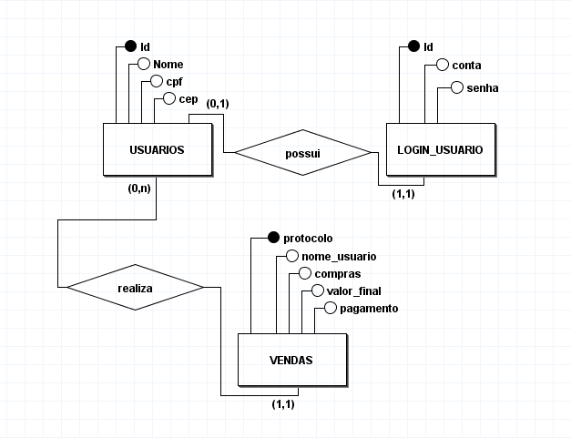
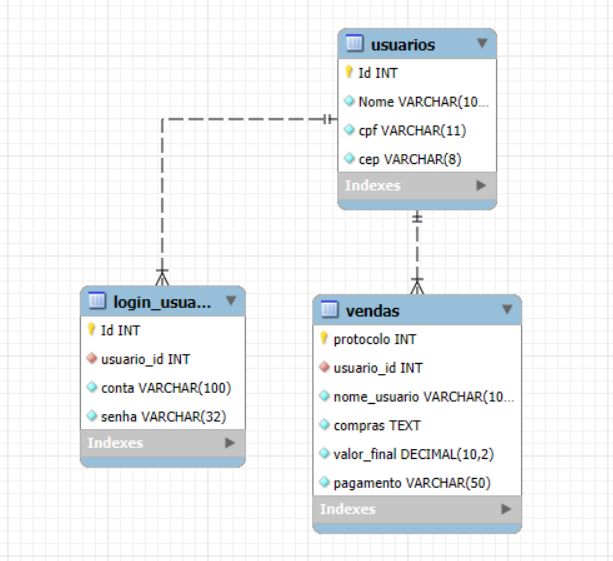

# INFILME
**Arthur Teixeira Soares e Bernardo Silva Gomes**

# Descrição do sistema
O INFILME é um sistema web de aluguel de filmes. O objetivo é oferecer ao cliente uma vitrine online onde ele pode conhecer os filmes disponíveis, escolher os que deseja, montar um carrinho e finalizar o aluguel, recebendo um número de protocolo como comprovante.
O que o sistema permite realizar
- Consultar o catálogo de filmes, com imagem, descrição, gênero e preço.
- Cadastrar-se e acessar o sistema com usuário e senha.
- Adicionar filmes ao carrinho, controlar a quantidade e remover itens.
- Finalizar a compra escolhendo a forma de pagamento e obter o protocolo.

# Principais funcionalidades
- Vitrine de filmes: os filmes são carregados do banco de dados, sem precisar alterar o código para incluir ou mudar um produto.
- Cadastro e login: os dados pessoais (nome, CPF e CEP) ficam separados dos dados de acesso (usuário e senha criptografada).
- Carrinho de compras: cada usuário tem seu carrinho salvo no banco, com a quantidade de cada filme. O preço não é repetido no carrinho, pois é lido da tabela de produtos.
- Finalização da compra: registra a venda, seus itens, a forma de pagamento (cartão de crédito, PIX ou boleto), o total e o protocolo.

# Informações que precisam ser armazenadas
- usuarios:
Código, nome completo, CPF (único) e CEP do cliente.
- login_usuario:
Código do usuário, nome de usuário (único) e senha em md5. Não guarda CPF.
- generos:
Código e nome do gênero (Ação, Animação, Comédia, Crime, Ficção Científica).
- produtos:
Código, nome, preço, descrição, imagem e gênero do filme.
- carrinho:
Código, usuário, filme e quantidade. Não guarda preço.
- vendas:
Protocolo, usuário, data e hora, forma de pagamento e total da compra.
- itens_venda:
Protocolo da venda, filme, quantidade e preço cobrado na data da compra.

**Modelo Entidade Relacionamento:**

**Modelo Lógico:**

**SQL para criação do banco de dados:**

DROP DATABASE IF EXISTS infilme;

CREATE DATABASE infilme
    CHARACTER SET utf8mb4
    COLLATE utf8mb4_general_ci;

USE infilme;

CREATE TABLE usuarios (
    Id INT NOT NULL AUTO_INCREMENT,
    nome VARCHAR(100) NOT NULL,
    cpf CHAR(11) NOT NULL,
    cep CHAR(8) NOT NULL,
    CONSTRAINT pk_usuarios PRIMARY KEY (Id),
    CONSTRAINT uq_usuarios_cpf UNIQUE (cpf)
);

CREATE TABLE login_usuario (
    usuario_id INT NOT NULL,
    conta VARCHAR(30) NOT NULL,
    senha CHAR(32) NOT NULL,
    CONSTRAINT pk_login_usuario PRIMARY KEY (usuario_id),
    CONSTRAINT uq_login_conta UNIQUE (conta),
    CONSTRAINT fk_login_usuario FOREIGN KEY (usuario_id)
        REFERENCES usuarios (Id)
        ON DELETE CASCADE
);

CREATE TABLE generos (
    Id INT NOT NULL AUTO_INCREMENT,
    nome VARCHAR(50) NOT NULL,
    CONSTRAINT pk_generos PRIMARY KEY (Id),
    CONSTRAINT uq_generos_nome UNIQUE (nome)
);

CREATE TABLE produtos (
    Id INT NOT NULL AUTO_INCREMENT,
    nome VARCHAR(100) NOT NULL,
    preco DECIMAL(10,2) NOT NULL,
    descricao TEXT,
    imagem VARCHAR(100),
    genero_id INT NOT NULL,
    CONSTRAINT pk_produtos PRIMARY KEY (Id),
    CONSTRAINT uq_produtos_nome UNIQUE (nome),
    CONSTRAINT ck_produtos_preco CHECK (preco > 0),
    CONSTRAINT fk_produtos_genero FOREIGN KEY (genero_id)
        REFERENCES generos (Id)
);

CREATE TABLE carrinho (
    Id INT NOT NULL AUTO_INCREMENT,
    usuario_id INT NOT NULL,
    produto_id INT NOT NULL,
    quantidade INT NOT NULL DEFAULT 1,
    CONSTRAINT pk_carrinho PRIMARY KEY (Id),
    CONSTRAINT uq_carrinho_item UNIQUE (usuario_id, produto_id),
    CONSTRAINT ck_carrinho_qtd CHECK (quantidade > 0),
    CONSTRAINT fk_carrinho_usuario FOREIGN KEY (usuario_id)
        REFERENCES usuarios (Id)
        ON DELETE CASCADE,
    CONSTRAINT fk_carrinho_produto FOREIGN KEY (produto_id)
        REFERENCES produtos (Id)
        ON DELETE CASCADE
);

CREATE TABLE vendas (
    protocolo INT NOT NULL AUTO_INCREMENT,
    usuario_id INT NOT NULL,
    data_venda DATETIME NOT NULL DEFAULT CURRENT_TIMESTAMP,
    pagamento VARCHAR(30) NOT NULL,
    total DECIMAL(10,2) NOT NULL DEFAULT 0,
    CONSTRAINT pk_vendas PRIMARY KEY (protocolo),
    CONSTRAINT ck_vendas_pagamento CHECK (pagamento IN ('Cartão de Crédito', 'PIX', 'Boleto')),
    CONSTRAINT fk_vendas_usuario FOREIGN KEY (usuario_id)
        REFERENCES usuarios (Id)
);

CREATE TABLE itens_venda (
    venda_protocolo INT NOT NULL,
    produto_id INT NOT NULL,
    quantidade INT NOT NULL,
    preco_unitario DECIMAL(10,2) NOT NULL,
    CONSTRAINT pk_itens_venda PRIMARY KEY (venda_protocolo, produto_id),
    CONSTRAINT ck_itens_qtd CHECK (quantidade > 0),
    CONSTRAINT ck_itens_preco CHECK (preco_unitario > 0),
    CONSTRAINT fk_itens_venda FOREIGN KEY (venda_protocolo)
        REFERENCES vendas (protocolo)
        ON DELETE CASCADE,
    CONSTRAINT fk_itens_produto FOREIGN KEY (produto_id)
        REFERENCES produtos (Id)
);

INSERT INTO usuarios (Id, nome, cpf, cep) VALUES
    (NULL, 'Administrador', '52998224725', '01310100');

INSERT INTO login_usuario (usuario_id, conta, senha) VALUES
    (1, 'admin', MD5('123456'));

INSERT INTO generos (Id, nome) VALUES
    (NULL, 'Ação'),
    (NULL, 'Animação'),
    (NULL, 'Comédia'),
    (NULL, 'Crime'),
    (NULL, 'Ficção Científica');

INSERT INTO produtos (Id, nome, preco, descricao, imagem, genero_id) VALUES
(NULL, 'Batman: O Cavaleiro das Trevas', 14.90, 'Agora com a ajuda do tenente Jim Gordon e do promotor público Harvey Dent, Batman tem tudo para banir o crime de Gotham City de uma vez por todas. Mas em breve, os três serão vítimas do Coringa, que pretende lançar Gotham em uma anarquia.', 'Batman O cavaleiro das trevas.jpg', 1),
(NULL, 'De Volta para o Futuro', 12.50, 'Marty McFly viaja para 1955 com a máquina do tempo do cientista Dr. Brown. Ele deve garantir que seus pais se apaixonem, para não arriscar sua própria existência.', 'De volta para o futuro.jpg', 5),
(NULL, 'Devoradores de Estrelas', 9.90, 'Um astronauta tenta salvar a Terra enquanto está sozinho no espaço sideral.', 'Devoradores de estrelas.jpeg', 5),
(NULL, 'Homem-Aranha: Através do Aranhaverso', 16.00, 'Viajando pelo multiverso, Miles Morales conhece um novo time de Pessoas-Aranha, formado por heróis de diversas dimensões. Mas quando os heróis entram em conflito sobre como lidar com uma nova ameaça, Miles se vê em um impasse.', 'HomemAranhaAtravesdoaranhaverso.jpg', 2),
(NULL, 'Interestelar', 15.50, 'Uma equipe de exploradores viaja através de um buraco de minhoca no espaço, na tentativa de garantir a sobrevivência da humanidade.', 'Interestelar.jpg', 5),
(NULL, 'Kill Bill - Volume 1', 11.90, 'Depois de despertar de um coma de quatro anos, uma antiga assassina busca vingança contra o grupo de assassinos que a traiu.', 'Kill Bill.jpg', 1),
(NULL, 'Matrix', 13.00, 'Um hacker aprende com os misteriosos rebeldes sobre a verdadeira natureza de sua realidade e seu papel na guerra contra seus controladores.', 'Matrix.jpg', 5),
(NULL, 'O Diabo Veste Prada 2', 10.50, 'Sequência de O Diabo Veste Prada (2006).', 'O diabo veste prada 2.png', 3),
(NULL, 'O Exterminador do Futuro', 12.90, 'Um assassino ciborgue do futuro tenta encontrar e matar Sarah Connor, uma garçonete que está destinada a ser a mãe de um homem que salvará a humanidade da extinção.', 'O exterminador do futuro.jpg', 1),
(NULL, 'Pulp Fiction: Tempo de Violência', 12.50, 'As vidas de dois assassinos da máfia, um boxeador, um gângster e sua esposa, e um par de bandidos se entrelaçam em quatro histórias de violência e redenção.', 'Pulp Fiction.jpg', 4),
(NULL, 'Guerra nas Estrelas: O Império Contra-Ataca', 15.00, 'Depois que a Aliança Rebelde é dominada pelo Império, Luke Skywalker começa seu treinamento Jedi com Yoda, enquanto seus amigos são perseguidos por toda a galáxia por Darth Vader e pelo caçador de recompensas Boba Fett.', 'Star Wars ep V.jpg', 5),
(NULL, 'Zootopia 2', 13.50, 'A corajosa coelha policial Judy Hopps e seu amigo, a raposa Nick Wilde, unem-se novamente para solucionar um novo caso, o mais perigoso e intrincado de suas carreiras.', 'Zootopia 2.jpeg', 2);